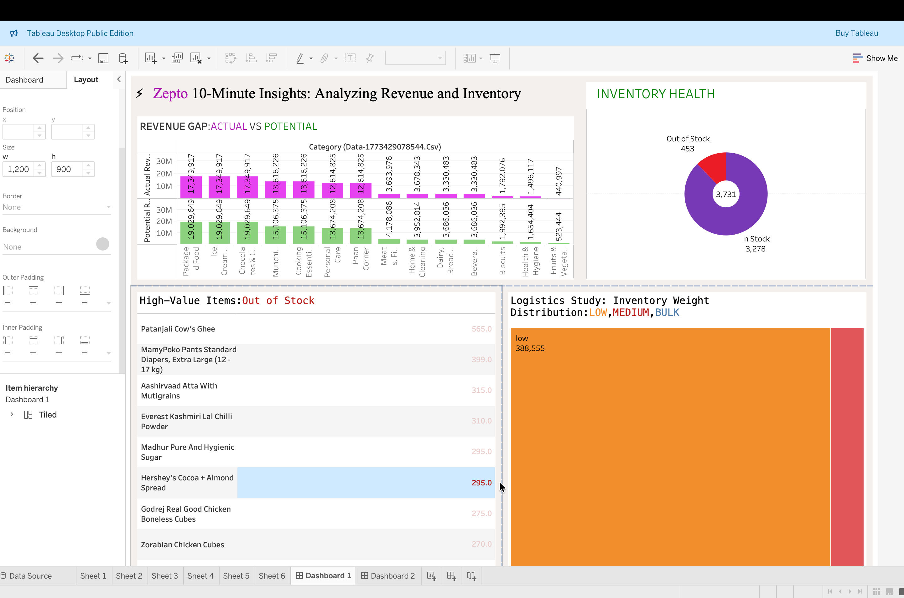

⚡ Zepto 10-Minute Insights: Analyzing Revenue and Inventory
Project Overview
This project transforms raw inventory data into actionable business intelligence. Using **PostgreSQL** for data engineering and **Tableau** for visualization, I identified key revenue leaks and optimized stock categorization for Zepto.

## 📊 Executive Dashboard

[Tableau Public](https://public.tableau.com/views/zepto_inventory_analysis2026/Dashboard1?:language=en-US&:sid=&:redirect=auth&:display_count=n&:origin=viz_share_link)
## 🛠️Stack of Tech- **Database:** PostgreSQL (for cleaning data and adding features)
- **Tableau Desktop for Visualization**
- **Analysis:** Statistics and predicting trends
## 📖Key Insights from SQL
- **Revenue Recovery:** Identified high-MRP items with frequent stockouts to prevent revenue loss.
- **Logistics Optimization:** Categorized inventory by weight (Low/Medium/Bulk) to streamline delivery 10-minute windows.
- **Data Integrity:** Handled unit conversions and price audits to ensure 100% reporting accuracy.
- -**Price Elasticity & Discount Impact: Analyzed the relationship between Discount Percentage and OutOfStock status to determine if aggressive pricing is causing supply chain strain.
Contact: [Anika Towsin Rahi] | 🎓 Statistics Student @ [Jagannath University,Dhaka,Bangladesh] | 📧 [anikatowsinrahi@gmail.com]
